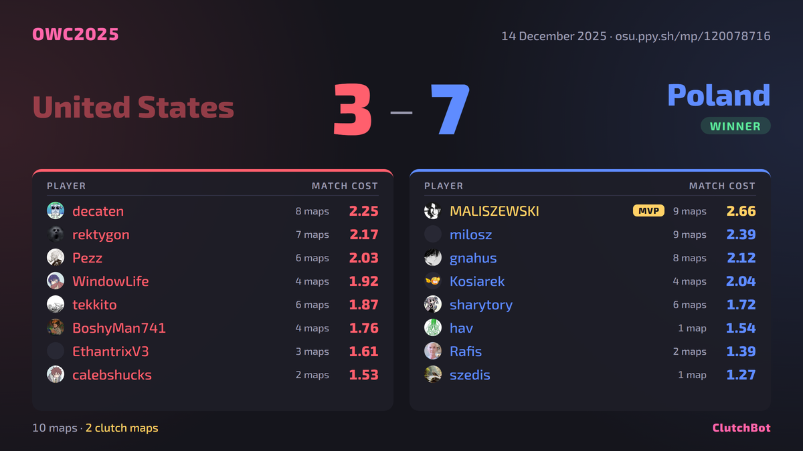
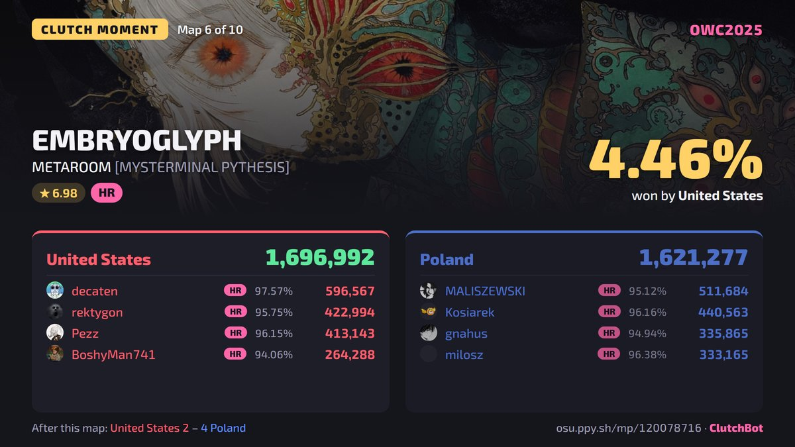

<p align="center">
  
</p>

<h1 align="center">ClutchBot</h1>

<p align="center">
  Twitter bot that watches osu! tournament matches and posts results, match costs and the closest maps.
</p>

<p align="center">
  <a href="https://x.com/ClutchBotOsu"></a>
  <a href="https://github.com/Taldux/clutchbot/actions/workflows/ci.yml"></a>
  <a href="https://github.com/Taldux/clutchbot/pkgs/container/clutchbot"></a>
  
</p>

---

<p align="center">
  
  &nbsp;
  
</p>

## Features

- observes for lobbies of known tournaments
- posts a result card once a match finishes: final score, both rosters and every player's match cost
- finds clutch maps, maps won by less than 5% (configurable)
- supports team-vs and head-to-head (1v1) matches

## Internals

- [osu!api](https://osu.ppy.sh/docs/)
- [httpx](https://www.python-httpx.org/) for the osu! and X APIs
- [Jinja2](https://jinja.palletsprojects.com/) templates rendered by [Playwright](https://playwright.dev/python/) Chromium
- Database for states: SQLite
- [Bathbot](https://github.com/MaxOhn/Bathbot), used the same match cost formula

## Want your tourney tracked?

Honestly, just shoot me a DM on discord under @taldux. I'll try to regularly track the most important tourneys. If your tourney is not at least 4 digit though, chances are a bit slimmer.

## Setup

Realistically it's not worth running this on your own. It's not a heavy project but not much you can do with it.

### Prerequisites

- **Docker** with the compose plugin, *or* [uv](https://docs.astral.sh/uv/) for running it locally

### Running with Docker

```sh
mkdir clutchbot && cd clutchbot
curl -O https://raw.githubusercontent.com/Taldux/clutchbot/main/docker-compose.yml
curl -o .env https://raw.githubusercontent.com/Taldux/clutchbot/main/.env.example
# fill in .env, then:
mkdir data && curl -o data/acronyms.json https://raw.githubusercontent.com/Taldux/clutchbot/main/acronyms.example.json
sudo chown -R 1000:1000 data       # the container runs as uid 1000 (i guess)
docker network create monitoring   # once, if you don't run Prometheus
docker compose up -d
```

### Running locally

```sh
uv sync
uv run playwright install chromium
cp .env.example .env               # write keys
uv run clutchbot process 117358530 --dry-run
```

### Configuration

All settings come from environment variables or `.env`. See [`.env.example`](.env.example) for the full list.

| Variable | Default | Description |
| --- | --- | --- |
| `OSU_CLIENT_ID` / `OSU_CLIENT_SECRET` | – | osu! OAuth application |
| `TWITTER_*` | – | the four X keys, only needed for posting |
| `DRY_RUN` | `true` | render and log, never post |
| `POLL_INTERVAL_SECONDS` | `600` | how often the listing is checked |
| `CLUTCH_THRESHOLD_PERCENT` | `5` | the margin that counts as clutch |
| `WARMUP_GAMES_CHECKED` | `2` | how many first maps may be warmups |
| `EZ_MULTIPLIER` | `1.5` | score multiplier for EZ on FreeMod maps, `1` turns it off |
| `NTFY_URL` | – | ntfy topic for alerts |
| `METRICS_PORT` | – | serve Prometheus metrics on this port |

## Usage

```sh
clutchbot listen                          # watch for matches and post them
clutchbot process <match id or link>      # post one match by hand
clutchbot render <match id or link>       # only draw the cards
clutchbot acronyms list | add | remove    # manage tracked tournaments
clutchbot check-config | check-x | check-alerts | check-fonts
```
